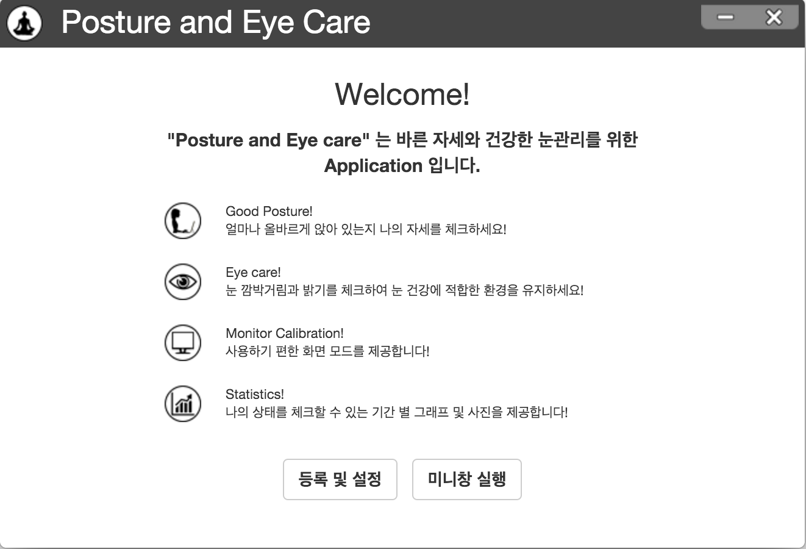
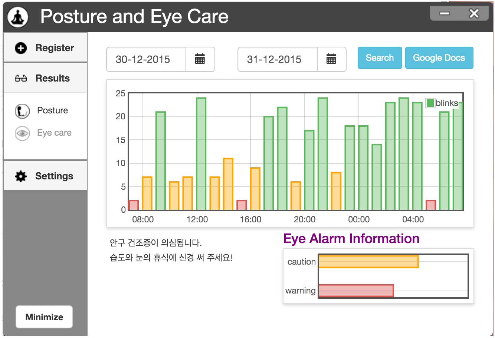
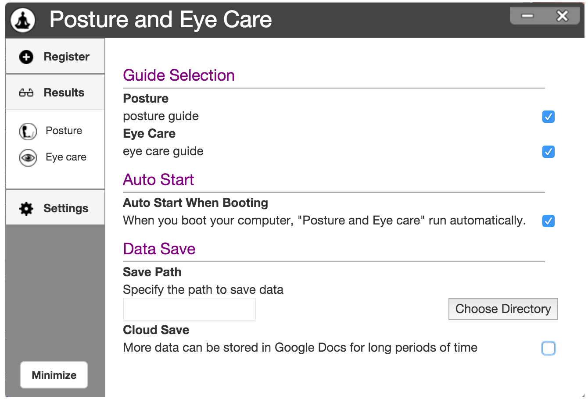

# Web based "Posture and Eyecare" Application
Healthcare web application for PC/laptop users.

It tracks user facial position and eye blink.

Through its algorithm and calculation, it encourages the user to adjust their working posture and frequently blink to prevent slouching and dry eye syndrome.

